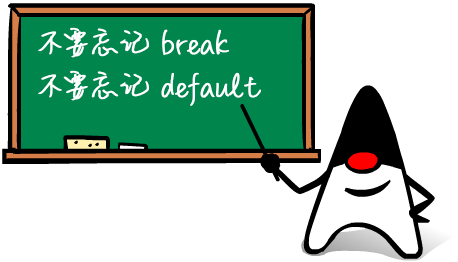

除了 if 语句外，还有一种条件判断，是根据某个表达式的结果，分别去执行不同的分支。

例如，在游戏中，让用户选择选项：

-   单人模式
-   多人模式
-   退出游戏

这时，<code>switch</code> 语句就派上用场了。

<code>switch</code> 语句根据 <code>switch(表达式)</code> 计算的结果，跳转到匹配的 <code>case</code> 结果，然后继续执行后续语句，直到遇到 <code>break</code> 结束执行。

我们看一个例子：

```java
public class Main {
    public static void main(String[] args) {
        int option = 1;
        switch (option) {
        case 1:
            System.out.println("Selected 1");
            break;
        case 2:
            System.out.println("Selected 2");
            break;
        case 3:
            System.out.println("Selected 3");
            break;
        }
    }
}
```

修改 <code>option</code> 的值分别为 <code>1</code><code>2</code><code>3</code>，观察执行结果。

如果 <code>option</code> 的值没有匹配到任何 <code>case</code>，例如 <code>option = 99</code>，那么，<code>switch</code> 语句不会执行任何语句。这时，可以给 <code>switch</code> 语句加一个<code>default</code> ，当没有匹配到任何 <code>case</code> 时，执行 <code>default</code>

```java
public class Main {
    public static void main(String[] args) {
        int option = 99;
        switch (option) {
        case 1:
            System.out.println("Selected 1");
            break;
        case 2:
            System.out.println("Selected 2");
            break;
        case 3:
            System.out.println("Selected 3");
            break;
        default:
            System.out.println("Not selected");
            break;
        }
    }
}
```

如果把 <code>swtich</code> 语句翻译成 <code>if</code> 语句，那么上述的代码相当于：

```java
if (option == 1) {
    System.out.println("Selected 1");
} else if (option == 2) {
    System.out.println("Selected 2");
} else if (option == 3) {
    System.out.println("Selected 3");
} else {
    System.out.println("Not selected");
}
```

对于多个<code>==</code>判断的情况，使用 <code>swtich</code> 结构更加清晰。

同时注意，上述“翻译”只有在 <code>swtich</code> 语句中对每个 <code>case</code> 正确编写了 <code>break</code> 语句才能对应得上。

使用 <code>swtich</code> 时，注意 <code>case</code> 语句并没有花括号<code>{}</code>，而且，<code>case</code> 语句具有<font style="color: var(--vp-c-brand);">“穿透性”</font>，漏写 <code>break</code> 将导致意想不到的结果：

```java
public class Main {
    public static void main(String[] args) {
        int option = 2;
        switch (option) {
        case 1:
            System.out.println("Selected 1");
        case 2:
            System.out.println("Selected 2");
        case 3:
            System.out.println("Selected 3");
        default:
            System.out.println("Not selected");
        }
    }
}
```

当 <code>option = 2</code> 时，将依次输出<code>"Selected 2"</code>、<code>"Selected 3"</code>、<code>"Not selected"</code>，原因是从匹配到 <code>case 2</code> 开始，后续语句将全部执行，直到遇到<code>break</code> 语句。因此，任何时候都不要忘记写 <code>break</code>

如果有几个 <code>break</code> 语句执行的是同一组语句块，可以这么写：

```java
public class Main {
    public static void main(String[] args) {
        int option = 2;
        switch (option) {
        case 1:
            System.out.println("Selected 1");
            break;
        case 2:
        case 3:
            System.out.println("Selected 2, 3");
            break;
        default:
            System.out.println("Not selected");
            break;
        }
    }
}
```

使用<code>switch</code>语句时，只要保证有<code>break</code>，<code>case</code>的顺序不影响程序逻辑：

```java
switch (option) {
case 3:
    ...
    break;
case 2:
    ...
    break;
case 1:
    ...
    break;
}
```

但是仍然建议按照自然顺序排列，便于阅读。

<code>swtich</code>语句还可以匹配字符串。字符串匹配时，是比较“内容相等”。例如：

```java
public class Main {
    public static void main(String[] args) {
        String fruit = "apple";
        switch (fruit) {
        case "apple":
            System.out.println("Selected apple");
            break;
        case "pear":
            System.out.println("Selected pear");
            break;
        case "mango":
            System.out.println("Selected mango");
            break;
        default:
            System.out.println("No fruit selected");
            break;
        }
    }
}
```

<code>switch</code> 语句还可以使用枚举类型，枚举类型我们在后面讲解。

### 编译检查

使用 IDE 时，可以自动检查是否漏写了 <code>break</code> 语句和 <code>default</code> 语句，方法是打开 IDE 的编译检查。

在 Eclipse 中，选择 <code>Preferences</code> - <code>Java</code> - <code>Compiler</code> - <code>Errors/Warnings</code> - <code>Potential programming problems</code>，将以下检查标记为 <code>Warning：</code>

-   'switch' is missing 'default' case
-   'switch' case fall-through

在 Idea 中，选择 <code>Preferences</code> - <code>Editor</code> - <code>Inspections</code> - <code>Java</code> -<code>Control flow issues</code> ，将以下检查标记为 <code>Warning：</code>

-   Fallthrough in 'switch' statement
-   'switch' statement without 'default' branch
    当 <code>switch</code> 语句存在问题时，即可在 IDE 中获得警告提示。

     <!-- 此路径表示图片和MD文件，处于同一目录 -->

### switch 表达式

使用 <code>switch</code> 时，如果遗漏了 <code>break</code>，就会造成严重的逻辑错误，而且不易在源代码中发现错误。从 Java 12 开始，switch 语句升级为更简洁的表达式语法，使用类似模式匹配（Pattern Matching）的方法，保证只有一种路径会被执行，并且不需要 <code>break</code> 语句：

```java
public class Main {
    public static void main(String[] args) {
        String fruit = "apple";
        switch (fruit) {
        case "apple" -> System.out.println("Selected apple");
        case "pear" -> System.out.println("Selected pear");
        case "mango" -> {
            System.out.println("Selected mango");
            System.out.println("Good choice!");
        }
        default -> System.out.println("No fruit selected");
        }
    }
}
```

意新语法使用<code>-></code>，如果有多条语句，需要用<code>{}</code>括起来。不要写 <code>break</code> 语句，因为新语法只会执行匹配的语句，没有穿透效应。

很多时候，我们还可能用 <code>switch</code> 语句给某个变量赋值。例如：

```java
int opt;
switch (fruit) {
case "apple":
    opt = 1;
    break;
case "pear":
case "mango":
    opt = 2;
    break;
default:
    opt = 0;
    break;
}
```

使用新的 switch 语法，不但不需要 break，还可以直接返回值。把上面的代码改写如下：

```java
public class Main {
    public static void main(String[] args) {
        String fruit = "apple";
        int opt = switch (fruit) {
            case "apple" -> 1;
            case "pear", "mango" -> 2;
            default -> 0;
        }; // 注意赋值语句要以;结束
        System.out.println("opt = " + opt);
    }
}
```

这样可以获得更简洁的代码。

### yield

大多数时候，在 <code>switch</code> 表达式内部，我们会返回简单的值。

但是，如果需要复杂的语句，我们也可以写很多语句，放到<code>{...}</code>里，然后，用 <code>yield</code> 返回一个值作为 <code>switch</code> 语句的返回值：

```java
public class Main {
    public static void main(String[] args) {
        String fruit = "orange";
        int opt = switch (fruit) {
            case "apple" -> 1;
            case "pear", "mango" -> 2;
            default -> {
                int code = fruit.hashCode();
                yield code; // switch语句返回值
            }
        };
        System.out.println("opt = " + opt);
    }
}
```

### 小结

<code>switch</code> 语句可以做多重选择，然后执行匹配的 <code>case</code> 语句后续代码；

<code>switch</code> 的计算结果必须是整型、字符串或枚举类型；

注意千万不要漏写 <code>break</code>，建议打开 <code>fall-through</code> 警告；

总是写上 <code>default</code>，建议打开 <code>missing default</code> 警告；

从 Java 14 开始，<code>switch</code> 语句正式升级为表达式，不再需要 <code>break</code>，并且允许使用 <code>yield</code> 返回值。
